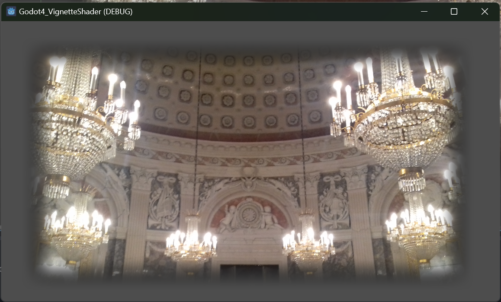
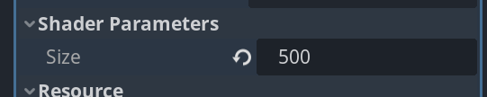
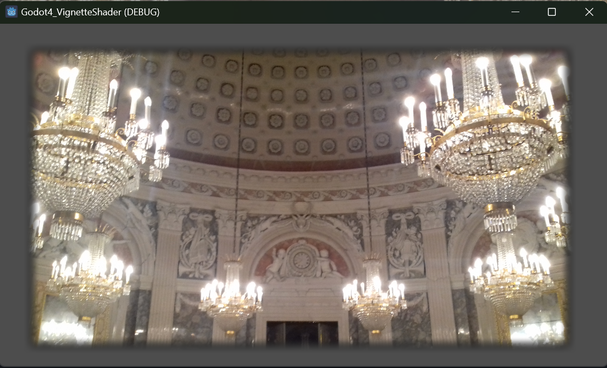
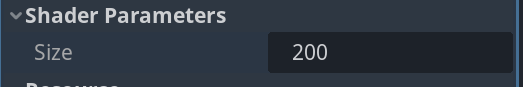

# Godot4 Vignette Shader

## Shader with size parameter 500





## Shader with size parameter 200





## In the code:

```c
uniform float size = 200.0;
```

You can also modify this parameter from gdscript:

```gdscript
self.material.set_shader_parameter("size", 300)
```

I have implemented it in one of my shaders (02_WhiteRectMouse) in this project --> https://github.com/TechnoLukas/Godot4-Shaders 
